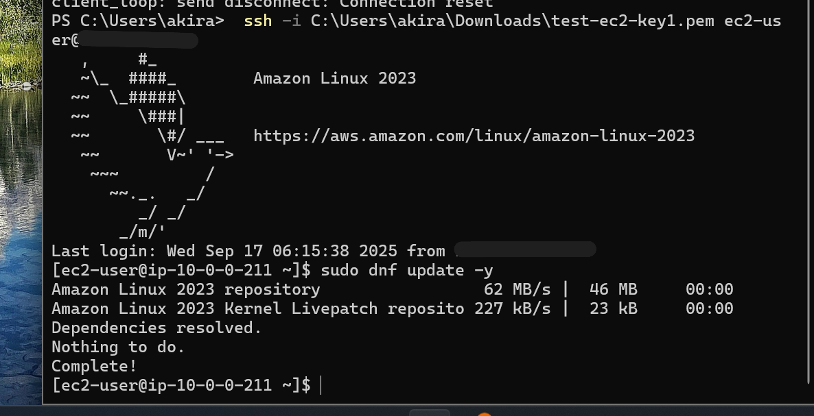

# Troubleshooting dnf update Failure on EC2  

*This repository includes English first, followed by Japanese.*  
（この後ろに日本語版が続きます）  

---

## Overview  

Amazon Linux 2023 instance failed to run `sudo dnf update -y` due to repeated timeouts.  
The root cause was that the outbound rule in the security group was restricted to **TCP/22 only**, which blocked HTTPS traffic.  
After updating the outbound rule to allow all traffic, the update succeeded.  

---

## Before (Error)  

Running `dnf update` resulted in `Curl error (28): Timeout`.  

  

---

## Investigation  

* `ping 8.8.8.8` → Success → The instance could reach the internet  
* `curl -I https://aws.amazon.com` → Failed → HTTPS (443) traffic was blocked  

  

---

## Root Cause  

Outbound rules allowed only **TCP/22**.  
Even with destination `0.0.0.0/0`, only port 22 was open, so HTTPS requests could not go through.  

  

---

## Solution  

Changed outbound rules to **All traffic / 0.0.0.0/0**.  

  

---

## Success  

Re-ran `dnf update` and the update completed successfully.  

  

---

## Lessons Learned  

* Destination `0.0.0.0/0` alone does not guarantee communication; port restrictions also apply  
* AWS security groups are stateful, so outbound is typically configured as "All traffic"  

---

# EC2での`dnf update`解決記録  

## 概要  

Amazon Linux 2023 で `sudo dnf update -y` を実行した際、タイムアウトで失敗した。  
原因はセキュリティグループのアウトバウンド設定が **TCP/22 のみ**となっており、HTTPS 通信が遮断されていたことだった。  
アウトバウンドを「すべてのトラフィック許可」に変更後、更新は成功した。  

---

## 問題発生  

`dnf update` 実行時に `Curl error (28): Timeout` が発生。  

  

---

## 調査過程  

* `ping 8.8.8.8` → 成功 → ネットワーク自体には到達可能  
* `curl -I https://aws.amazon.com` → 失敗 → HTTPS (443) がブロックされていると推定  

  

---

## 原因  

アウトバウンドが **TCP/22 のみ**許可されていた。  
宛先が `0.0.0.0/0` でも、22番ポートだけが開いていたため HTTPS が利用できなかった。  

  

---

## 解決方法  

アウトバウンドを **すべてのトラフィック / 0.0.0.0/0** に修正。  

  

---

## 解決  

再度 `dnf update` を実行し、正常に完了。  

  

---

## 学び  

* 宛先が `0.0.0.0/0` でも、ポートが限定されていれば通信は制限される  
* AWS のセキュリティグループはステートフルであり、アウトバウンドは「すべて許可」にするのが一般的  

